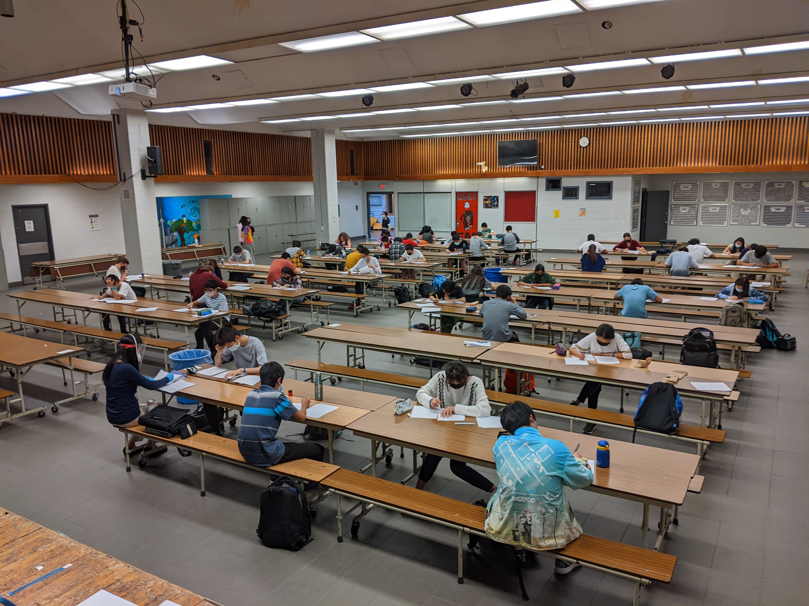

## MGCI Math Club
## [Resources](/resources)

MGCI Math Club is the math club at Marc Garneau Collegiate Institute! We're a community of students dedicated to promoting math in our school.  

Through the course of the year, we run weekly lectures and organize teams to go to various competitions such as the CHMMC, CMIMC, Girls in Math at Yale, and ARML. 

### MGMT

The Marc Garneau Mathematics Tournament (MGMT) was first held in 2013. It was then run annually until 2019.  After a two year hiatus, it was restarted in 2022. 

The Marc Garneau Math Tournament is an opportunity for teams across the GTA to meet other members of the math community, sharpen their problem solving skills, and most importantly, have fun!

The format of the competition has differed over the years. Currently, teams of 4 compete in three rounds; team, guts, and individual. The 2021-22 MGMT ran on June 20th, 2022 from 3-8 pm. 

Wolfram generously sponsored us to provide some of the prizes that were available at this year's MGMT. Many thanks!

A special thanks to Wolfram, Jane Street, and TTMath for sponsoring the 2023 MGMT!

### Workshops

### The Team
2022-23 Executives:\
Miranda Zhao - President\
Maggie Pang - VP of Events\
Emily Ma - VP of Lectures\
Olivia Huang - Marketing\
Anthony Chen - Treasury + Web\
Caroline Cheng\
Elaine Qian\
Darian Yan\
Aris Chen\
William Dai\
Andrew Lin

2021-22 Executives:\
Miranda Zhao - Copresident\
Hao Cui - Copresident\
Anthony Chen - Treasury + Web\
Olivia Huang - Marketing\
Max Lu - Marketing\
Aris Chen\
William Dai\
Emily Ma\
Maggie Pang

2020-21 Executives:\
Andrew Liang - President\
Miranda Zhao - Vice President\
Hao Cui\
Ethan Hu\
Laura Gao\
Andrew Wu\
Jonathan Wu

2019-20 Executives: \
Michael Li \
Kevin Wan

Please contact us if you have information for other years.

### Contact Us
[mgci.math.society@gmail.com](mailto:mgci.math.society@gmail.com)
